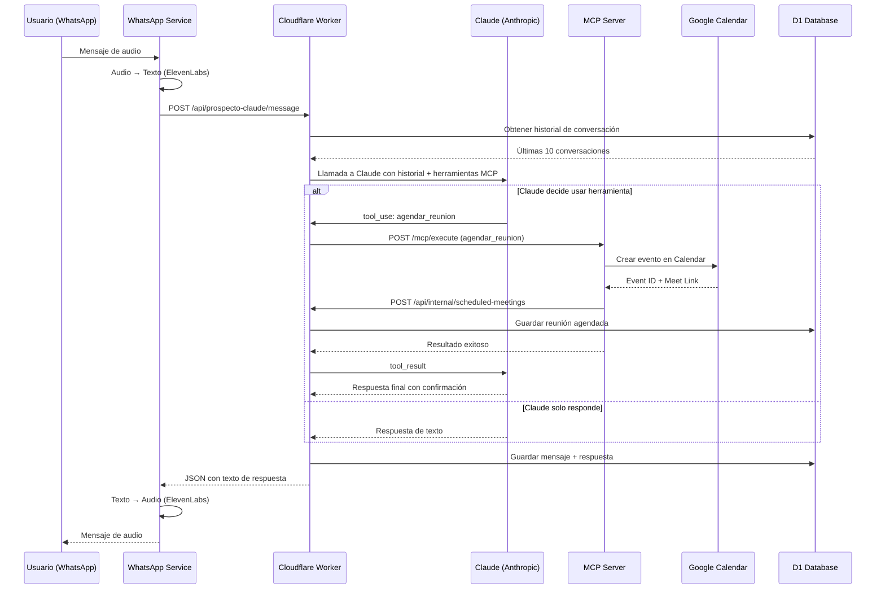
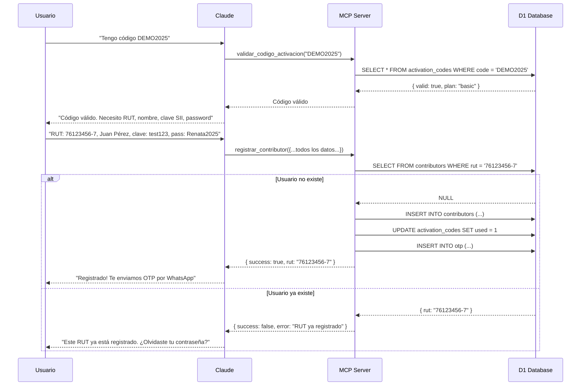
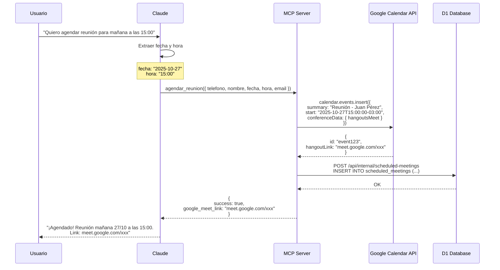

# Diagramas de Flujo - Claude + MCP

## 🔄 Flujo Completo: WhatsApp → Claude → MCP → Respuesta



---

## 📝 Flujo de Registro con Código de Activación



---

## 📅 Flujo de Agendamiento de Reunión



---

## 🔁 Ciclo de Tool Use en Claude

```
┌──────────────────────────────────────────────────────┐
│  1. Usuario envía mensaje                           │
│     "Quiero agendar reunión mañana 15:00"            │
└─────────────────┬────────────────────────────────────┘
                  │
                  ↓
┌──────────────────────────────────────────────────────┐
│  2. Worker construye mensajes para Claude            │
│     [historial] + [mensaje actual]                   │
└─────────────────┬────────────────────────────────────┘
                  │
                  ↓
┌──────────────────────────────────────────────────────┐
│  3. Llamada a Claude con herramientas MCP            │
│     model: claude-3-5-sonnet-20241022                │
│     tools: [agendar_reunion, registrar_, validar_]   │
└─────────────────┬────────────────────────────────────┘
                  │
                  ↓
          ┌───────┴───────┐
          │               │
    stop_reason:    stop_reason:
     "tool_use"      "end_turn"
          │               │
          ↓               ↓
┌──────────────────┐  ┌─────────────────────────┐
│  4a. Claude      │  │  4b. Claude responde    │
│  quiere usar     │  │  directamente           │
│  herramienta     │  │  (sin herramientas)     │
└────┬─────────────┘  └──────────┬──────────────┘
     │                           │
     ↓                           ↓
┌──────────────────┐       ┌──────────────────┐
│  5. Ejecutar     │       │  FIN             │
│  herramienta MCP │       │  Retornar texto  │
└────┬─────────────┘       └──────────────────┘
     │
     ↓
┌──────────────────────────────────────────────────────┐
│  6. Agregar tool_result al historial                 │
│     { role: "user", content: [{ type: "tool_result", │
│       tool_use_id: "...", content: "{...}" }]}       │
└─────────────────┬────────────────────────────────────┘
                  │
                  ↓
┌──────────────────────────────────────────────────────┐
│  7. Llamar a Claude nuevamente con el resultado      │
│     (Iteración 2, máximo 5 iteraciones)              │
└─────────────────┬────────────────────────────────────┘
                  │
                  ↓
          ┌───────┴───────┐
          │               │
    Otra tool_use?   end_turn
          │               │
          ↓               ↓
    Repetir paso 4    Retornar respuesta final
```

---

## 🎭 Estados de Conversación

```
┌─────────────────────────────────────────────────┐
│          PRIMER MENSAJE (Sin historial)         │
│                                                  │
│  Usuario: "Hola"                                 │
│  Claude: "¿Tienes código o prefieres reunión?"  │
│                                                  │
│  → Estado: IDENTIFICANDO_INTENCION              │
└──────────────────┬──────────────────────────────┘
                   │
         ┌─────────┴─────────┐
         │                   │
         ↓                   ↓
┌─────────────────┐  ┌──────────────────┐
│ TIENE CÓDIGO    │  │ QUIERE REUNIÓN   │
└────────┬────────┘  └────────┬─────────┘
         │                    │
         ↓                    ↓
┌─────────────────┐  ┌──────────────────┐
│ VALIDAR CÓDIGO  │  │ SOLICITAR FECHA  │
│ (tool: validar_)│  │                  │
└────────┬────────┘  └────────┬─────────┘
         │                    │
         ↓                    ↓
┌─────────────────┐  ┌──────────────────┐
│ SOLICITAR DATOS │  │ CONFIRMAR HORA   │
│ - RUT           │  │                  │
│ - Nombre        │  └────────┬─────────┘
│ - Clave SII     │           │
│ - Password      │           ↓
└────────┬────────┘  ┌──────────────────┐
         │           │ AGENDAR REUNIÓN  │
         │           │ (tool: agendar_) │
         ↓           └────────┬─────────┘
┌─────────────────┐           │
│ REGISTRAR       │           │
│ (tool:          │           │
│  registrar_)    │           │
└────────┬────────┘           │
         │                    │
         └──────────┬─────────┘
                    │
                    ↓
         ┌──────────────────┐
         │   COMPLETADO     │
         │                  │
         │ Guardado en D1   │
         └──────────────────┘
```

---

## 🔐 Flujo de Autenticación de Requests

```
┌─────────────────────────────────────────┐
│  WhatsApp Service                       │
│  POST /api/prospecto-claude/message     │
│  Headers:                               │
│    Authorization: Bearer <API_KEY>      │
└──────────────────┬──────────────────────┘
                   │
                   ↓
┌─────────────────────────────────────────┐
│  Middleware de Auth                     │
│  if (apiKey !== AGENT_API_KEY)          │
│    → return 401 Unauthorized            │
└──────────────────┬──────────────────────┘
                   │
                   ↓ (Autorizado)
┌─────────────────────────────────────────┐
│  Procesar mensaje                       │
│  - Historial                            │
│  - Claude + MCP                         │
│  - Guardar respuesta                    │
└──────────────────┬──────────────────────┘
                   │
                   ↓
┌─────────────────────────────────────────┐
│  MCP Server (Herramientas)              │
│  POST /api/internal/*                   │
│  Headers:                               │
│    Authorization: Bearer <API_KEY>      │
└──────────────────┬──────────────────────┘
                   │
                   ↓
┌─────────────────────────────────────────┐
│  Middleware de Auth (Internal Routes)   │
│  if (apiKey !== AGENT_API_KEY)          │
│    → return 401 Unauthorized            │
└──────────────────┬──────────────────────┘
                   │
                   ↓ (Autorizado)
┌─────────────────────────────────────────┐
│  Ejecutar acción en D1                  │
│  - Validar código                       │
│  - Guardar reunión                      │
└─────────────────────────────────────────┘
```

---

## 📊 Flujo de Datos en D1

```
┌──────────────────────────────────────────────────┐
│  Tablas de Datos                                 │
└──────────────────────────────────────────────────┘

┌───────────────────┐
│ contributors      │  ← Usuario registrado
│ - rut (PK)        │
│ - nombre          │
│ - telefono        │
│ - verified        │
└─────────┬─────────┘
          │
          │ FK: used_by_rut
          │
┌─────────▼─────────┐
│ activation_codes  │  ← Códigos pre-generados
│ - code (PK)       │
│ - empresa_nombre  │
│ - used            │
│ - used_by_rut     │
└───────────────────┘

┌───────────────────┐
│ conversation_     │  ← Historial de prospectos
│    history        │
│ - telefono        │
│ - mensaje_cliente │
│ - respuesta_agent │
│ - timestamp       │
└───────────────────┘

┌───────────────────┐
│ scheduled_        │  ← Reuniones agendadas
│    meetings       │
│ - telefono        │
│ - nombre_prospecto│
│ - fecha           │
│ - google_event_id │
│ - status          │
└───────────────────┘

┌───────────────────┐
│ messages          │  ← Mensajes de clientes
│ - rut             │     (usuarios registrados)
│ - sender          │
│ - content         │
└───────────────────┘
```

---

## 🎯 Decisiones de Claude (Lógica Interna)

```
┌─────────────────────────────────────────────────┐
│  System Prompt de Claude                        │
│                                                  │
│  "Tu objetivo es:                               │
│   1. Si tiene código → registrar                │
│   2. Si no tiene código → agendar reunión"      │
└──────────────────┬──────────────────────────────┘
                   │
                   ↓
         ┌─────────────────────┐
         │  Analizar mensaje   │
         └──────────┬──────────┘
                    │
        ┌───────────┼───────────┐
        │           │           │
        ↓           ↓           ↓
┌─────────────┐ ┌────────┐ ┌──────────┐
│ Menciona    │ │Menciona│ │ General  │
│ "código"    │ │"reunión│ │ consulta │
│ "activación"│ │"cita"  │ │          │
└──────┬──────┘ └───┬────┘ └────┬─────┘
       │            │           │
       ↓            ↓           ↓
┌─────────────┐ ┌────────┐ ┌──────────┐
│ Flujo de    │ │Flujo de│ │ Informar │
│ Registro    │ │Agendar │ │ y ofrecer│
│             │ │        │ │ opciones │
└──────┬──────┘ └───┬────┘ └────┬─────┘
       │            │           │
       └────────────┼───────────┘
                    │
                    ↓
         ┌─────────────────────┐
         │ ¿Tiene datos        │
         │ completos?          │
         └──────────┬──────────┘
                    │
            ┌───────┴───────┐
            │               │
           SÍ              NO
            │               │
            ↓               ↓
    ┌──────────────┐  ┌──────────────┐
    │ Usar         │  │ Solicitar    │
    │ herramienta  │  │ dato faltante│
    │ MCP          │  │              │
    └──────────────┘  └──────────────┘
```

---

## 📱 Transformación de Audio (ElevenLabs)

```
┌──────────────────────────────────────────────────┐
│  Entrada desde WhatsApp                          │
│  Audio OGG                                       │
└──────────────────┬───────────────────────────────┘
                   │
                   ↓
┌──────────────────────────────────────────────────┐
│  WhatsApp Service                                │
│  - Convertir OGG → WAV (ffmpeg)                  │
│  - ElevenLabs Speech-to-Text                     │
└──────────────────┬───────────────────────────────┘
                   │
                   ↓ TEXTO
┌──────────────────────────────────────────────────┐
│  Cloudflare Worker                               │
│  - Procesar con Claude + MCP                     │
│  - Generar respuesta en TEXTO                    │
└──────────────────┬───────────────────────────────┘
                   │
                   ↓ TEXTO
┌──────────────────────────────────────────────────┐
│  Response Formatter (formatResponse)             │
│  if (source === "whatsapp")                      │
│    → ElevenLabs Text-to-Speech                   │
│  else                                            │
│    → return texto plano                          │
└──────────────────┬───────────────────────────────┘
                   │
                   ↓ Audio MP3
┌──────────────────────────────────────────────────┐
│  WhatsApp Service                                │
│  - Enviar audio a usuario                        │
└──────────────────────────────────────────────────┘
```

---

## 🔄 Comparación: OpenAI vs Claude

### Antes (OpenAI)
```
Usuario → Worker → OpenAI (2 llamadas)
                   1. Clasificar intención
                   2. Generar respuesta
          → Guardar → Responder
```

### Ahora (Claude + MCP)
```
Usuario → Worker → Claude (1 llamada con tools)
                   - Analiza intención
                   - Usa herramientas si necesita
                   - Genera respuesta
          → MCP Server → Google Calendar / D1
          → Guardar → Responder
```

**Ventajas:**
- ✅ 1 sola llamada al LLM (más eficiente)
- ✅ Claude decide autónomamente cuándo usar tools
- ✅ Acciones ejecutadas en tiempo real (Calendar, DB)
- ✅ Más conversacional y natural

---

## 🎊 Resultado Final

Un sistema completo de ventas conversacional que:
1. Entiende contexto y toma decisiones
2. Ejecuta acciones reales (agendar, registrar)
3. Mantiene historial de conversaciones
4. Funciona con audio (WhatsApp nativo)
5. Se integra con Google Calendar automáticamente

¡Todo funcionando con Claude + MCP! 🚀
